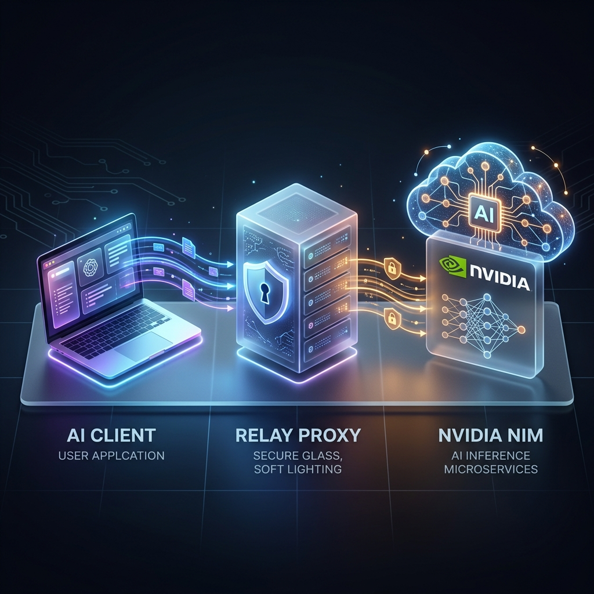
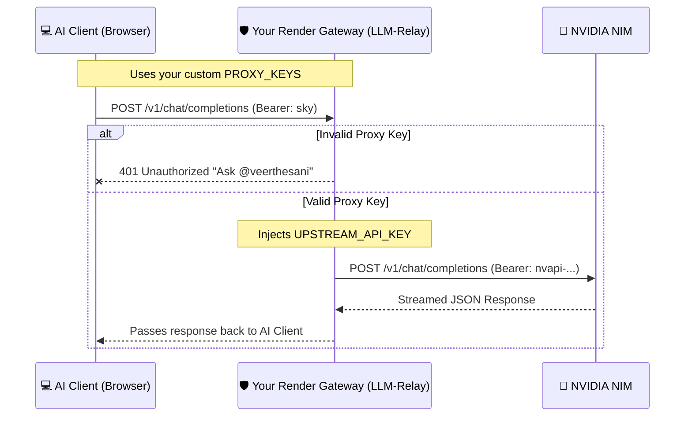

# LLM Relay Gateway Documentation

> [!NOTE]
> This document explains the architecture and utilization of your LLM Relay Gateway, a lightweight proxy that connects your frontend AI clients to upstream providers like NVIDIA NIM securely.

## 🏗️ Architecture Visualization

The core concept is that the client application **never** talks to NVIDIA directly, keeping your real API key completely hidden on the server.

## 🔑 The Two-Key Security System

The project uses two distinct keys to ensure absolute security and quota control:

1. **`UPSTREAM_API_KEY` (The Real Key)**
   - **What it is**: Your actual NVIDIA NIM key (`nvapi-...`).
   - **Where it lives**: Securely on your Render dashboard environment variables.
   - **Who sees it**: Nobody. It never leaves the server.

2. **`PROXY_KEYS` (The Front-Door Key)**
   - **What it is**: A password you invent (e.g., `sky`).
   - **Where it lives**: Configured on Render, given to your client application.
   - **Who sees it**: You and anyone you trust to chat using your quota.

## 🌐 Endpoints

Your relay provides several useful routes out-of-the-box:

| Endpoint | Method | Purpose | Requires Key? |
| :--- | :--- | :--- | :--- |
| `/` | `GET` | Displays the beautiful system dashboard. | No |
| `/health` | `GET` | Used for uptime monitoring (`{"status": "ok"}`). | No |
| `/stats` | `GET` | Shows request counts, rate limits, and model usage. | **Yes** |
| `/v1/models` | `GET` | Lists all valid models available from NVIDIA. | **Yes** |
| `/v1/chat/completions` | `POST` | The main engine that processes chat requests. | **Yes** |

## 🚀 Full Utilization Setup (Client Configuration)

To start chatting, configure your frontend client exactly like this:

1. **API Selection**: Choose `Proxy` (or Custom OpenAI URL).
2. **Proxy URL**: `https://llm-relay-veer.onrender.com/v1/chat/completions`
   > [!IMPORTANT]
   > You must include the full `/v1/chat/completions` path at the end of the URL.
3. **API Key**: Enter your `PROXY_KEYS` value (e.g., `sky`).
4. **Model Name**: Type an exact model ID that NVIDIA supports (e.g., `minimaxai/minimax-m3` or `deepseek-ai/deepseek-r1`).
5. **Thinking Toggles**: Turn the client's reasoning toggles **off**. Your server handles reasoning via the `REASONING_MODE` environment variable.

## 🛠️ Troubleshooting Guide

If a chat fails, look at the error message in your client:

* **401 Unauthorized**: The client is sending the wrong proxy key, or no key at all.
* **404 Not Found**: You forgot the `/v1/chat/completions` path in the Proxy URL.
* **400 Bad Request**: NVIDIA rejected the request. This usually means the model ID has a typo, or the specific model is currently down on NVIDIA's side.
* **"The server is locked behind a key"**: Someone tried to access your server without permission. You are completely safe!

---

## 🔮 Roadmap & v3 Promises

We are actively improving the LLM Relay Gateway. Here are the features planned for the upcoming **v3 release**:

- **🚀 Multi-Provider Support**: Seamlessly route requests to not just NVIDIA NIM, but also OpenAI, Anthropic, OpenRouter, and more using a unified gateway.
- **📊 Advanced Analytics Dashboard**: A dedicated frontend GUI to visualize token usage, active models, and real-time request logs directly from your `/stats` endpoint.
- **🔒 Dynamic API Key Rotation**: Automatically cycle through multiple upstream API keys if one hits rate limits or runs out of credits.
- **🛡️ Custom Rate Limiting per User**: Ability to define rate limits on a per-proxy-key basis rather than globally, preventing a single user from hogging your quota.
- **🌐 Better Streaming Error Transparency**: Streamlined forwarding of exact API errors mid-stream to help debug upstream issues instantly.
- **🔌 Webhooks Integration**: Fire off webhooks for monitoring when your gateway hits certain error thresholds or rate limits.

Stay tuned for these updates!
